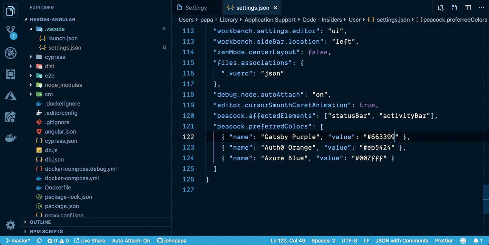
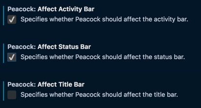
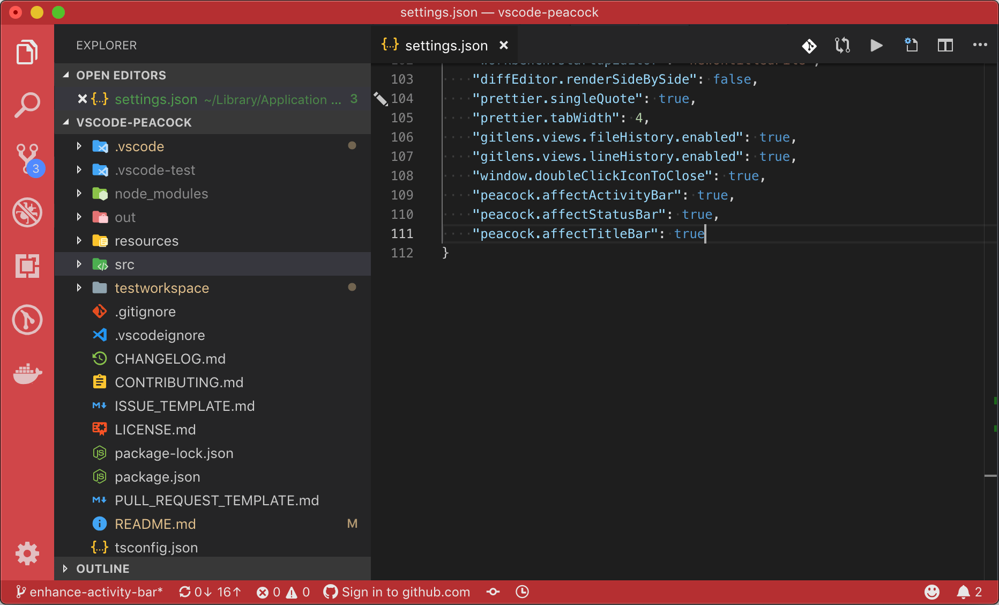
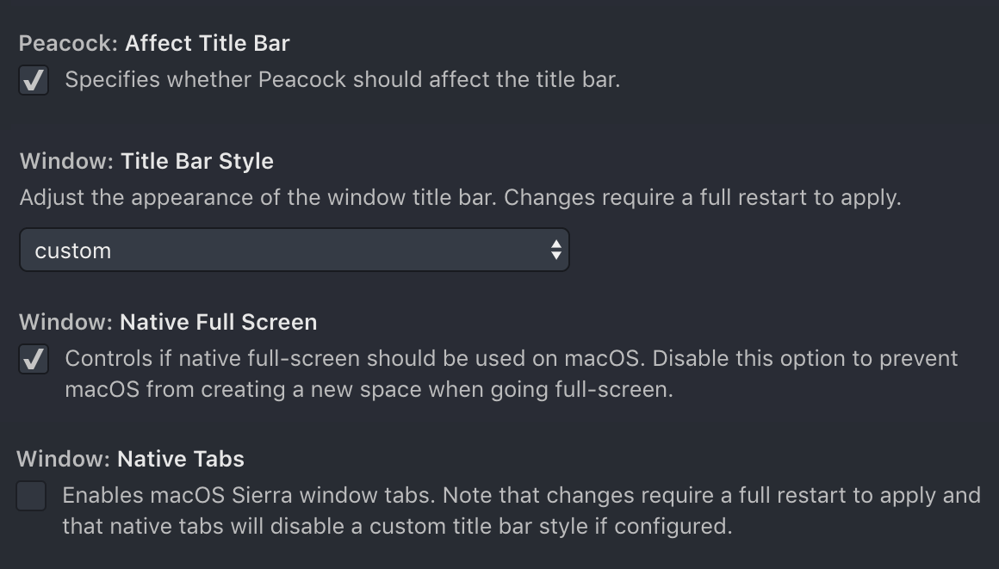

# Peacock for Visual Studio Code

[](https://marketplace.visualstudio.com/items?itemName=johnpapa.vscode-peacock&wt.mc_id=vscodepeacock-github-jopapa) [](https://marketplace.visualstudio.com/items?itemName=johnpapa.vscode-peacock)
[](https://marketplace.visualstudio.com/items?itemName=johnpapa.vscode-peacock) [](http://opensource.org/licenses/MIT) [](https://greenkeeper.io/)

[](https://johnpapa.visualstudio.com/vscode-peacock/_build/latest?definitionId=3&branchName=master)

 A Visual Studio Code extension that subtly changes the workspace color of your workspace. Ideal when you have multiple VS Code instances and you want to quickly identify which is which.

## Install

1. Open **Extensions** sidebar panel in Visual Studio Code. `View → Extensions`
1. Search for `Peacock`
1. Click **Install**
1. Click **Reload**, if required


## Features

Commands can be found in the command palette. Look for commands beginning with `Peacock:`

- Change the color of [Affected Elements](#Affected-Elements) (see `peacock.affect*` in the [Settings](#Settings) section) to
  - [user defined color](#Input-Formats)
  - a random color
  - the primary color for angular, vue, or react
- Select a user-defined color from your [Favorite Colors](#Favorite-Colors)
- Save a user-defined color with the [Save Favorite Color](#Save-Favorite-Color)
- [Adjust the coloring of affected elements](#Element-Adjustments) by making them slightly darker or lighter to provide a subtle visual contrast between them
- Saves colors to your workspace in the `.vscode/settings.json` file

## Settings

| Property                    | Description                                                                                           |
| --------------------------- | ----------------------------------------------------------------------------------------------------- |
| peacock.affectActivityBar   | Specifies whether Peacock should affect the activity bar                                              |
| peacock.affectStatusBar     | Specifies whether Peacock should affect the status bar                                                |
| peacock.affectTitleBar      | Specifies whether Peacock should affect the title bar (see [title bar coloring](#title-bar-coloring)) |
| peacock.elementAdjustments  | fine tune coloring of affected elements                                                               |
| peacock.favoriteColors      | array of objects for color names and hex values                                                       |
| peacock.keepForegroundColor | Specifies whether Peacock should change affect colors                                                 |
| peacock.surpriseMeOnStartup | Specifies whether Peacock apply a random color on startup                                             |

### Favorite Colors

After setting 1 or more colors (hex or named) in the user setting for `peacock.favoriteColors`, you can select `Peacock: Change to a Favorite Color` and you will be prompted with the list from `peacock.favoriteColors` from user settings.

```text
Gatsby Purple -> #123456
Auth0 Orange -> #eb5424
Azure Blue -> #007fff
```

Favorite colors require a user-defined name (`name`) and a value ( `value` ), as shown in the example below.

```javascript
  "peacock.favoriteColors": [
    { "name": "Gatsby Purple", "value": "#639" },
    { "name": "Auth0 Orange", "value": "#eb5424" },
    { "name": "Azure Blue", "value": "#007fff" }
  ]
```

> You can find brand color hex codes from <https://brandcolors.net>

#### Preview Your Favorite

When opening the Favorites command in the command palette, Peacock now previews (applies) the color as you cycle through them. If you cancel (press ESC), your colors revert to what you had prior to trying the Favorites command



#### Save Favorite Color

When you apply a color you enjoy, you can go to the workspace `settings.json` and copy the color's hex code, then create your own favorite color in your user `settings.json`. This involves a few manual steps and arguably is not obvious at first.

The `Peacock: Save Current Color as Favorite Color` feature allows you to save the currently set color as a favorite color, and prompts you to name it.

### Affected Elements

You can tell peacock which parts of VS Code will be affected by when you select a color. You can do this by checking the appropriate setting that applies to the elements you want to be colored. The choices are:



### Element Adjustments

You can fine tune the coloring of affected elements by making them slightly darker or lighter to provide a subtle visual contrast between them. Options for adjusting elements are:

- `"darken"`: reduces the value of the selected color to make it slightly darker
- `"lighten"`: increases the value of the selected color to make it slightly lighter
- `"none"`: no adjustment will be made to the selected color

An example of using this might be to make the Activity Bar slightly lighter than the Status Bar and Title Bar to better visually distinguish it as present in several popular themes. This can be achieved with the setting in the example below.

```javascript
  "peacock.affectActivityBar": true,
  "peacock.affectStatusBar": true,
  "peacock.affectTitleBar": true,
  "peacock.elementAdjustments": {
    "activityBar": "lighten"
  }
```

When using peacock with the Angular Red color, this results in the Activity Bar being slightly lighter than the Status Bar and Title Bar (see below).



## Keep Foreground Color

Recommended to remain false (the default value).

When set to true Peacock will not colorize the foreground of any of the affected elements and will only alter the background. Some users may desire this if their theme's foreground is their preference over Peacock. In this case, when set to true, the foreground will not be affected.

## Surprise Me On Startup

Recommended to remain false (the default value).

When set to true Peacock will automatically apply a random color when opening a workspace that does not define color customizations. This can be useful if you frequently open many instances of VS Code and you are interested in quickly and easily telling them apart, but are not overly committed to the specific color applied.

## Commands

| Command                                  | Description                                                              |
| ---------------------------------------- | ------------------------------------------------------------------------ |
| Peacock: Reset Colors                    | Removes any of the color settings from the `.vscode/setttings.json` file |
| Peacock: Enter a Color                   | Prompts you to enter a color (see [input formats](#input-formats))       |
| Peacock: Color to Vue Green              | Sets the color to Vue.js's main color, #42b883                           |
| Peacock: Color to Angular Red            | Sets the color to Angular's main color, #b52e31                          |
| Peacock: Color to React Blue             | Sets the color to React.js's main color, #00b3e6                         |
| Peacock: Surprise me with a Random Color | Sets the color to a random color                                         |
| Peacock: Change to a Favorite Color      | Prompts user to select from their Favorites                              |
| Peacock: Save Current Color to Favorites | Save Current Color to their Favorites                                    |

## Input Formats

When entering a color in Peacock several formats are acceptable. These include

| Format            | Examples                                         |
| ----------------- | ------------------------------------------------ |
| Named HTML colors | purple, blanchedalmond                           |
| Short Hex         | #8b2, f00                                        |
| Short Hex8 (RGBA) | #8b2c, f00c                                      |
| Hex               | #88bb22, ff0000                                  |
| Hex8 (RGBA)       | #88bb22cc, ff0000cc                              |
| RGB               | rgb (136, 187, 34), rgb 255 0 0                  |
| RGBA              | rgba (136, 187, 34, .8), rgba 255 0 0 .8         |
| HSL               | hsl (80, 69%, 43%), hsl (0 1 .5)                 |
| HSLA              | hsla (80, 69%, 43%, 0.8), hsla (0 1 .5 .8)       |
| HSV               | hsv (80, 82%, 73%), hsv (0 1 1)                  |
| HSVA              | hsva (80, 82%, 73%, 0.8), hsva (0,100%,100%,0.8) |

All formats offer flexible data validation:

- For named HTML colors, case is insensitive
- For any hex value, the `#` is optional.
- For any color formula value all parentheses and commas are optional and any number can be a decimal or percentage (with the exception of the alpha channel in rgba(), hsla(), and hsva() which must be a decimal between 0 and 1).

## Roadmap

There are many features in the roadmap. Please refer to the [issues list and feel free to grab one and contribute](https://github.com/johnpapa/vscode-peacock/issues)!

## Changes

See the [CHANGELOG](CHANGELOG.md) for the latest changes.

## FAQ

### Peacock Behavior

Peacock affects:

- the titlebar, activitybar, and statusbar elements
- anything regarding the readability of these elements
- background and foreground colors
- any elements that are displayed within these peacock elements (e.g. badges, hover)

### Changing User Settings

When any Peacock setting is changed, Peacock should update the colors appropriately based on the most recently used color during the active VS Code instance's session.

#### Example 1

User selects a color, then later changes which elements are affected.

1. User chooses "surprise me" and sets the color to #ff0000
1. Peacock saves #ff0000 in memory as the most recently used color
1. User goes to settings and unchecks the "Peacock: Affect StatusBar"
1. Peacock listens to this change, clears all colors and reapplies the #ff0000

#### Example 2

User opens VS Code, already has colors in their workspace, and immediately changes which elements are affected.

1. User opens VS Code
1. Workspace colors are set to #369
1. User goes to settings and unchecks the "Peacock: Affect StatusBar"
1. Peacock listens to this change, clears all colors and reapplies the #369

#### Example 3

User opens VS Code, has no colors in workspace, and immediately changes which elements are affected.

1. User opens VS Code
1. No workspace colors are set
1. Peacock's most recently used color is not set
1. User goes to settings and unchecks the "Peacock: Affect StatusBar"
1. Peacock listens to this change, however no colors are applied

### Title Bar Coloring

The VS Code Title Bar style can be configured to be custom or native with the `window.titleBarStyle` setting. When operating in native mode, Peacock is unable to colorize the Title Bar because VS Code defers Title Bar management to the OS. In order to leverage the Affect Title Bar setting to colorize the Title Bar, the `window.titleBarStyle` must be set to custom.

On macOS there are additional settings that can impact the Title Bar style and force it into native mode regardless of the `window.titleBarStyle` setting. These include:

- `window.nativeTabs` should be set to **false**. If using native tabs, the rendering of the title bar is deferred to the OS and native mode is forced.
- `window.nativeFullScreen` should be set to **true**. If not using native full screen mode, the custom title bar rendering presents issues in the OS and native mode is forced.

A successful and recommended settings configuration to colorize the Title Bar is:



## Credits

Inspiration comes in many forms. These folks and teams have contributed either through ideas, issues, pull requests, or guidance. Thank you!

- The VS Code team and their incredibly [helpful guide for creating extensions](https://code.visualstudio.com/api/get-started/your-first-extension?wt.mc_id=vscodepeacock-github-jopapa)

- Here are some great [examples for extensions](https://github.com/Microsoft/vscode-extension-samples) from the VS Code team

Key Contributors of PRs:

- [@josephrexme](https://twitter.com/josephrexme) for the name
- [@musicfuel](https://twitter.com/musicfuel) for the icon
- Implemented reset for each settings that isn't selected (by <https://github.com/souzara>)

Key Contributors of issues, reviews, and/or ideas:

- [@codebeast](https://twitter.com/codebeast), [@\_clarkio](https://twitter.com/_clarkio), [@burkeholland](https://twitter.com/burkeholland), [JulianG](https://github.com/JulianG),[@samjulien](https://twitter.com/samjulien),
  [@kushalpanda](https://twitter.com/kushalpanda)


## Try the Code

If you want to try the extension out start by cloning this repo, `cd` into the folder, and then run `npm install`.

Then you can run the debugger for the launch configuration `Run Extension`. Set breakpoints, step through the code, and enjoy!

> testing builds here .

## Resources

- [Get VS Code](https://code.visualstudio.com/?wt.mc_id=peacock-github-jopapa]
- [Create your first VS Code extension](https://code.visualstudio.com/api/get-started/your-first-extension?wt.mc_id=peacock-github-jopapa)
- [Get VS Code](https://code.visualstudio.com/?wt.mc_id=peacock-github-jopapa]
- [Learn how to add WebPack bundles to your favorite extensions](https://code.visualstudio.com/updates/v1_32#_bundling-extensions-with-webpack?wt.mc_id=peacock-github-jopapa)
